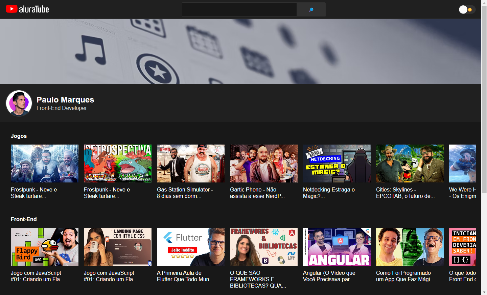

# AluraTube

> AluraTube

Projeto construído durante o evento Imersão React, promovido pela Alura.

[Clique aqui para acessar](https://aluratube-ten-drab.vercel.app/)

## Tecnologias

- JavaScript
- ReactJS
- Next.js
- Styled Components

## 💻 Projeto

O AluraTube é uma página de videos semelhante a página inicial do YouTube. A página foi desenvolvida usando ReactJS, Next.js Styled Components e escrito com JavaScript.
